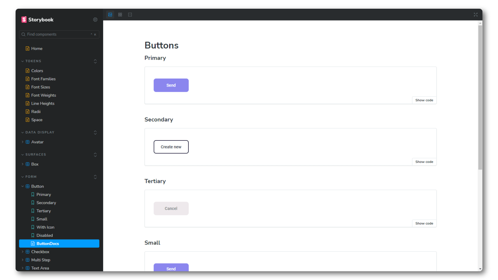
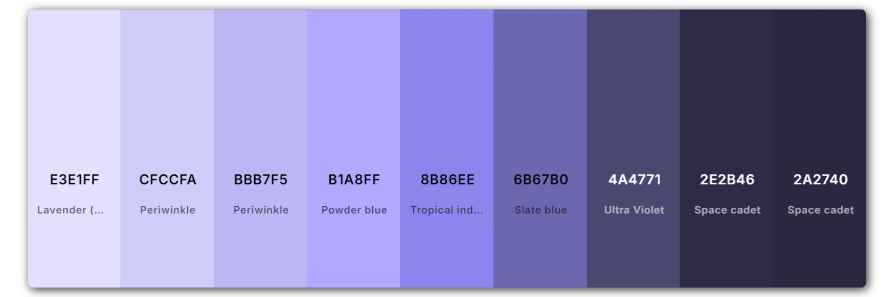

<h1 align="center">Sapuris UI</h1>

<p align="center">
    
    
    
    
</p>

<p align="center"></p>

## :page_with_curl: Description
This is my own design system, it contains a series of visual elements and style patterns that I use to develop my everyday applications.

> 💡 __SAPURIS__, refers to the pronunciation of the term サープリス (Sāpurisu), which is a Japanese translation of the English term "surplice". This term is used in the anime Saint Seiya to represent the undead costumes worn by the Specters. [Read More](https://saintseiya.fandom.com/pt-br/wiki/Sobrepelizes_de_Hades)

## :art: Colors
<p align="center"></p>

## :package: Packages
### Tokens
```
npm i @sapuris-ui/tokens
```

### React components
```
npm i @sapuris-ui/react
```

### Docs - Storybook
> https://gustavohps10.github.io/sapuris-design-system

## :game_die: Components

- [x] Text 
- [x] Heading
- [x] Box 
- [x] Button 
- [x] TextInput
- [x] TextArea
- [x] Checkbox
- [x] Avatar
- [x] MultiStep
- [More](https://gustavohps10.github.io/sapuris-design-system/)

## :gear: Running

### Fork and Clone
```
git clone https://github.com/<your-profile>/sapuris-design-system
```

### Install dependencies
```
npm install
```

### Run app with Turborepo
```
npm run dev
```

## :hammer_and_wrench: Tools
<p>
  
  
  
  
  
  
  
  
  
  
    
</p>

## :adult: Contributors

<!-- ALL-CONTRIBUTORS-LIST:START - Do not remove or modify this section -->
<!-- prettier-ignore-start -->
<!-- markdownlint-disable -->
<table>
  <tbody>
    <tr>
      <td align="center" valign="top" width="14.28%"><a href="https://gustavohenrique.vercel.app/"><br /><sub><b>Gustavo Henrique</b></sub></a><br /><a href="#code-Gustavohps10" title="Code">💻</a></td>
    </tr>
  </tbody>
</table>

<!-- markdownlint-restore -->
<!-- prettier-ignore-end -->

<!-- ALL-CONTRIBUTORS-LIST:END -->
